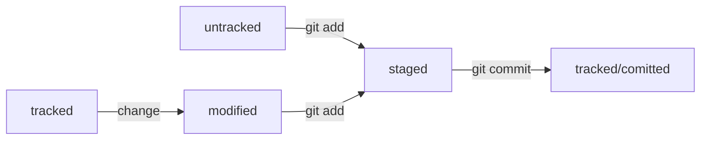

# Информация по Git.

## Инициализируем репозиторий.

- Инициализировать репозиторий можно с помощью команды git init.
- Проверить статус, или состояние, репозитория поможет команда git status.
- Если вы ошиблись и случайно инициализировали не ту папку, можно «разгитить» её — удалить скрытую подпапку .git.
```bash
$ cd <папка с репозиторием> # перешли в папку
$ rm -rf .git # удалили подпапку .git
ключ -r (от англ. recursive — «рекурсивно») позволяет удалять папки вместе с их содержимым;
ключ -f (от англ. force — «заставить») избавит вас от вопросов вроде «Вы точно хотите удалить этот файл? А этот? И этот тоже?».
```

## Добавляем файлы в репозиторий.

- Команда git add позволяет подготовить файл к сохранению.
- Команда git add --all подготовит к сохранению сразу все файлы.
- С помощью git add . можно добавить в репозиторий текущую папку со всеми файлами.

## Делаем коммит.

-Коммит можно сделать с помощью команды git commit.
- Ключ -m позволяет присвоить коммиту сообщение. Помните, что такие сообщения должны быть информативными: чётко описывать изменения.
- В коммит попадает то, что было предварительно добавлено «в корзину», или «в кадр», перед коммитом.

## Просматриваем историю коммитов — git log.

## GitHub.

- GitHub — платформа, которая работает с Git и упрощает командное взаимодействие.
- Кроме GitHub, существуют и другие подобные платформы, например GitLab, Bitbucket и так далее.
- Git — это консольный инструмент для работы с локальными и удалёнными репозиториями. Он не связан напрямую ни с одной из платформ и развивается отдельно от них.

## Создаём удалённый репозиторий.

1. Зайдите в свой профиль по ссылке https://github.com/username, где username — имя, которое вы указали при регистрации.
2. Создайте репозиторий. Для этого перейдите на вкладку Repositories (англ. «репозитории»), а затем нажмите на зелёную кнопку New (англ. «новый») справа.
3. Открылось окно создания нового репозитория. Назовите его first-project. Название удалённого репозитория необязательно должно совпадать с именем папки проекта у вас на компьютере. Но чтобы не путаться, будем называть их одинаково.

## SSH.

- SSH — протокол, который обеспечивает безопасный обмен данными в сети и использует для этого ключи.
- SSH-ключ — ваш виртуальный идентификатор в GitHub. Как ключ от квартиры, он позволяет получить доступ к GitHub-репозиторию. Также SSH используется для доступа к другим удалённым серверам.
- SSH-ключ состоит из двух частей — публичной и приватной. Публичный ключ зашифрует данные, а приватный — расшифрует. Приватным ключом ни в коем случае нельзя делиться, иначе любой сможет расшифровать все ваши секреты!

## Проверка наличия SSH-ключа.

```bash
$ cd ~ # перешли в домашнюю директорию
$ ls -la .ssh/ # вывели список созданных ключей
```

## Инструкция по генерации SSH-ключа.

```bash
$ ssh-keygen -t ed25519 -C "электронная почта, к которой привязан ваш аккаунт на GitHub"
$ ssh-keygen -t rsa -b 4096 -C "электронная почта, к которой привязан ваш аккаунт на GitHub"
```
## Привязываем SSH-ключ к GitHub.

```bash
# скопировать содержимое ключа в буфер обмена:
$ clip < ~/.ssh/id_rsa.pub
# для ed25519:
$ clip < ~/.ssh/id_ed25519.pub
```
1. Перейдите на GitHub и выберите пункт Settings (англ. «настройки») в меню аккаунта.
2. В меню слева нажмите на пункт SSH and GPG keys.
3. В открывшейся вкладке выберите New SSH key (англ. «новый SSH-ключ»).
4. В поле Title (англ. «заголовок») напишите название ключа. Например, Personal key (англ. «личный ключ»).
5. В поле Key type (англ. «тип ключа») должно быть Authentication Key (англ. «ключ аутентификации»).
6. В поле Key скопируйте ваш ключ из буфера обмена.
7. Нажмите на кнопку Add SSH key (англ. «добавить SSH-ключ»).
```bash
$ ssh -T git@github.com
```

## Связываем локальный и удалённый репозитории.

- Привязать удалённый репозиторий к локальному — git remote add
```bash
$ cd ~/dev/first-project
$ git remote add origin git@github.com:%ИМЯ_АККАУНТА%/first-project.git
$ git remote -v
origin    git@github.com:%ИМЯ_АККАУНТА%/%ИМЯ-ПРОЕКТА%.git (fetch)
origin    git@github.com:%ИМЯ_АККАУНТА%/%ИМЯ-ПРОЕКТА%.git (push)
```
- Флаг -v — короткая форма флага --verbose (англ. «подробный»). Он позволяет показать больше информации в выводе.

## Синхронизируем локальный и удалённый репозитории.

- Отправить изменения на удалённый репозиторий — git push
```bash
$ git push -u origin main # Если команда приведёт к ошибке, попробуйте 
                          # заменить main на master.
```
- Флаг -u свяжет локальную ветку с одноимённой удалённой.
- Коммиты хранятся в ветках. Начальная ветка создаётся автоматически и называется main или master.
- За отправку изменений на удалённый репозиторий отвечает команда git push.
- Интерфейс GitHub позволяет удобно просмотреть все коммиты в репозитории, а также изменения в этих коммитах.

## Файл [README.md](https://gist.github.com/fomvasss/8dd8cd7f88c67a4e3727f9d39224a84c)

## Хеш — идентификатор коммита

- Git преобразует информацию о коммитах с помощью алгоритма SHA-1 и для каждого из них рассчитывает уникальный идентификатор — хеш.
- Хеш — основной идентификатор коммита и позволяет узнать его автора, дату и содержимое закоммиченных файлов.
- Все хеши, а также таблицу соответствий хеш → информация о коммите Git хранит в папке .git.

## Исследуем лог

- Можно вызвать не только полный лог, но и сокращённый — это делается командой git log --oneline.
- В сокращённом логе выводятся сокращённые хеши — их можно использовать точно так же, как и полные.

## HEAD — всему голова

- В числе прочих файлов в папке .git есть служебный файл HEAD. Он указывает на самый свежий коммит.
- Вместо хеша последнего коммита можно написать слово HEAD — Git вас поймёт.

## Статусы файлов в Git

- Статусом untracked помечается файл, о существовании которого Git знает, но не следит за изменениями в нём. Этот статус — противоположность tracked, в который попадают все файлы, отслеживаемые Git.
- Файл переходит в статус staged после выполнения git add.
- Статус modified означает, что файл был изменён.
- Большинство файлов в проектах «шагает» по следующему циклу: «изменён» → «добавлен в список на коммит» → «закоммичен» → «изменён» → и так далее.



## Как читать git status

- Команда git status всегда подскажет, что происходит с файлом: например, он добавлен в список «на коммит» или ещё вообще не отслеживается, или изменён.
- git status показывает явно следующие состояния файлов: untracked, staged и modified.
- git status подсказывает, какие команды можно выполнить, чтобы поменять состояние файла.

## Оформление сообщений к коммитам

- Jira: В корпоративном стиле в начале сообщения обычно указывают Jira-ID, а после — текст сообщения.

```bash
$ git commit -m "LGS-239: Дополнить список пасхалок новыми числами"
```

- [Conventional Commits](https://www.conventionalcommits.org/ru): предлагает такой формат коммита: <type>: <сообщение>.

```bash
$ git commit -m "feat: добавить подсчёт суммы заказов за неделю"
```

- GitHub: Если коммит «закрывает» или «решает» какую-то задачу, то в его сообщении удобно указывать ссылку на неё.

```bash
$ git commit -m "Исправить #334, добавить график температуры"
```

- Для сообщений на русском языке часто рекомендуют использовать инфинитивы. Например: Добавить тесты для PipkaService, Исправить ошибку #123 и так далее.
- Для сообщений на английском рекомендуется использовать повелительное наклонение (англ. imperative). Например: Use library mega_lib_300, Fix exit button и так далее.

## Как исправить коммит

- --amend рассчитан на работу с последним коммитом (HEAD).
- Дополнить коммит новыми файлами можно с помощью git commit --amend --no-edit. Благодаря опции --no-edit сообщение к коммиту останется таким, каким и было.
- Изменить сообщение к коммиту позволяет команда git commit --amend -m "Обновлённое сообщение коммита".

## Как откатиться назад, если «всё сломалось»

- Команда git restore --staged <file> переведёт файл из staged обратно в modified или untracked.
- Команда git reset --hard <commit hash> «откатит» историю до коммита с хешем <hash>. Более поздние коммиты потеряются!
- Команда git restore <file> «откатит» изменения в файле до последней сохранённой (в коммите или в staging) версии.

## Просматриваем изменения в файлах

- Команда git diff сравнит последнюю закоммиченную версию файла с той, что находится в состоянии modified.
- Команда git diff --staged покажет изменения в staged-файлах относительно последних закоммиченных версий.

## Сопоставляем коммиты

- git diff показывает изменения, которые не были добавлены в staged.
Посмотреть изменения с помощью git diff можно, только если они не были проиндексированы или закоммичены.
- git log --oneline показывает первые несколько символов хеша и сообщение коммита.
Этой командой можно воспользоваться, когда не нужен полный хеш.
- git diff --staged показывает, что изменилось в проиндексированных файлах.
Ключ --staged говорит системе, что нужно смотреть изменения, которые были добавлены в staged.
- git diff a9928ab 11bada1 покажет различия коммитов с хешами a9928ab и 11bada1.

## Игнорирование файлов в Git

- Если нужно, чтобы Git игнорировал какие-то файлы, стоит составить файл .gitignore.
- Посмотреть, что игнорируется, можно с помощью команды git status --ignored.
- Сам файл .gitignore — это обычный файл в репозитории. Его тоже стоит закоммитить.
- Шаблонов много, но их легко найти в интернете вместе с примерами использования.
- Правила из .gitignore применяются только к новым (untracked) файлам. Если файл уже попал в staging area или в коммит, то правила на него не распространяются.
- Если строка начинается с #, то это комментарий, и .gitignore не будет его учитывать.
- Допустим, нужно, чтобы Git игнорировал все файлы .DS_Store. Для этого достаточно добавить в .gitignore строку с названием файла.
- Символ звёздочки соответствует любой строке, включая пустую.
- Вопросительный знак соответствует одному любому символу.
- Квадратные скобки, как и вопросительный знак, соответствуют одному символу. В скобках можно либо перечислить символы, либо задать диапазон.
- Косая черта, или слеш, указывает на каталоги.
- Функция парных звёздочек похожа на функцию одинарной. Отличие в том, как они работают с вложенными папками.
- Любое правило в файле .gitignore можно инвертировать с помощью восклицательного знака (!).

## [Шпаргалка по Git](https://practicum.yandex.ru/trainer/git-basics/lesson/b1ecee27-bb78-46a0-8d13-0364c7803f55/)

## Клонируем репозиторий

- Клонирование репозитория на GitHub - первое действие разработчика на новом месте работы.
- Процесс клонирования репозитория называется git clone.
- Клонирование репозитория позволяет скачать проект на свой компьютер и внести правки.
- Клонирование репозитория можно выполнить через консоль или кнопку "Code" на платформе GitHub.
- Команда git clone связывает локальный и удаленный репозиторий, обновляя копию при изменении проекта на GitHub.
- Для проверки связи репозиториев можно использовать команду git remote -v.

## Выполняем Fork

- Fork (fork) - операция на GitHub, которая создает копию репозитория в аккаунте пользователя.
- Fork используется для внесения вклада в проект, развития проекта независимо от исходного или создания своего проекта на основе чужого.
- Для выполнения Fork необходимо перейти на сайт GitHub, нажать на кнопку Fork в правом верхнем углу и создать копию репозитория.
- После создания копии можно вносить изменения и отправлять их в удаленный репозиторий.
- Fork может быть использован для клонирования репозитория на локальный компьютер.
Fork позволяет получить точную копию репозитория, которая полностью независима от исходного проекта.

## Что такое ветка?

- Ветка — это последовательность независимых изменений.
- Благодаря веткам несколько человек могут работать над одним репозиторием и не мешать друг другу. А ещё ветки помогают декомпозировать большую и страшную задачу на маленькие и понятные.
- Основная версия проекта хранится в главной ветке main (или master).
- С помощью команды git branch можно посмотреть, какие в проекте есть ветки и в какой из них вы сейчас находитесь.

## Создаём ветку

- Ветки в Git позволяют экспериментировать с проектом и разделять крупные задачи на мелкие.
- Создание ветки в Git осуществляется командой git branch <название_ветки>.
- Название ветки может состоять из букв, цифр и специальных символов, но не образуют иерархию.
- Ветки могут быть названы feature/add-branch-info или feature_add-branch-info.
- Ветки должны быть названы так, чтобы другим участникам было понятно, что в них происходит.
- Ветки могут содержать сколько угодно коммитов, а после завершения работы нужно объединить их.

## Шагаем с ветки на ветку

- Команда git checkout <название_ветки> позволяет переключаться на другую ветку.
- Разные ветки в одном проекте существуют независимо. Изменения в одной не влияют на изменения в другой.
- В Git можно создать ветку и сразу же перейти в неё командой git checkout -b <название_ветки>.
- Ветка указывает на коммит, который сделан в ней последним. При этом две ветки могут ссылаться на один и тот же коммит — например, если вы только что создали ветку, но ещё не успели внести в неё коммит.

## Сравниваем ветки

- git diff может сравнивать ветки по их названиям. Например, команда git diff main feature/my-feature выведет разницу между основной веткой и веткой feature/my-feature.
- Git поддерживает суффикс навигации ~. С его помощью можно сослаться на
  предыдущие коммиты. Например, если вы находитесь в ветке main и хотите
вывести разницу между тем коммитом, который был три коммита назад, и текущим,
нужно выполнить git diff main~3 main.
